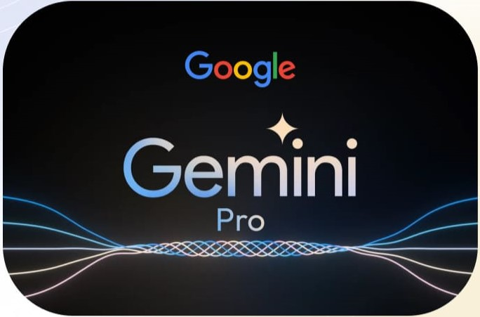

# 🎥 Youtube_Video_AI_Assistant 🤖🤳
---
## Overview
A Gradio-powered web app that answers questions about YouTube videos using their transcripts. It extracts the video transcript, splits it into chunks, creates embeddings with Google Generative AI, and performs similarity searches. Responses are generated using the Gemini Pro language model.

## ✨ Features

- 📄 Extracts transcripts from YouTube videos.
- 🔍 Splits transcripts into manageable chunks.
- 🤖 Creates embeddings for transcript chunks using Google Generative AI.
- 🔗 Performs similarity searches to find relevant transcript sections.
- 📝 Generates detailed responses using the Gemini Pro language model.
- 🖥️ Easy-to-use web interface powered by Gradio.

## 📽️ Demo Video


## LLM 🤖
<p align="center">

</p>

## How the transcription is working
<p align="center">

</p>

## 🚀 Installation

### Prerequisites

- Python 3.8 or higher
- pip (Python package installer)

### Clone the Repository

```bash
git clone https://github.com/yourusername/youtube-video-ai-assistant.git
cd youtube-video-ai-assistant
```

### Install Dependencies
```bash
pip install -r requirements.txt
```

### Environment Variables
#### Create a .env file in the root directory of the project and add your Google API key:
```env
API_Key=your_google_api_key_here
```

## 🛠️ Usage
### Running the Web Application:
```bash
python app.py
```
This will start the Gradio web application. You can access it in your browser at the URL provided in the terminal.
### Using the Web Interface
- Enter the YouTube video URL.
- Enter your question about the video.
- Click the submit button to get the response.

## 📂 Project Structure
- app.py: Main application file containing the Gradio interface and the main functions.
- requirements.txt: List of dependencies required for the project.
- .env: File containing environment variables (not included in the repository for security reasons).

## 🧠 How It Works
- Transcripts Extraction: The application extracts the transcript from the provided YouTube video URL.
- Text Splitting: The transcript is split into smaller chunks for better processing.
- Embedding Creation: The chunks are converted into embeddings using Google Generative AI.
- Similarity Search: A similarity search is performed on the embeddings to find the most relevant chunks.
- Response Generation: The relevant chunks are fed into the Gemini Pro language model to generate a detailed response to the user's question.

## 🤝 Contributing
Contributions are welcome! Please fork, open an issue or submit a pull request for any improvements as we all have 1 aim OPEN SOURCE FREEDOM 💫.

## 🙏 Acknowledgements
- Gradio
- LangChain
- Google Generative AI
- Hugging Face 🤗
